title: Data Preprocessing
date: 09/14/2018
author: Parth Shah

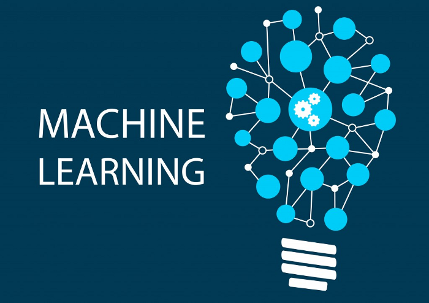

It was 6 pm on October 17th, 2018, when the wind came crashing at my window. I woke up from my little nap and as usual — I picked up my phone and went to YouTube. Well thanks to YouTube for recommending me this Siraj Raval’s video, where he simply asks each and every Machine Learning enthusiasts to just dedicate at least one hour of everyday towards studying or coding Machine Learning. I found that motivating as I would have a goal to accomplish every day, rather than having one life-long goal that will take all of my time and effort to reach.

From the very next moment, I was absolutely devoted to embarking in this one-hour-a-day-ship of Machine Learning. So far my journey has been smooth and I can say with certainty that anyone boarding this ship will definitely reach their destination.

**Note:**  If you are just like me, starting with machine learning, then I highly recommend you to take  [this](https://www.udemy.com/machinelearning/)  course by two professionals of Machine Learning-Kirill Eremenko and Hadelin de Ponteves.

**Data pre-processing**  is an important step in the data mining process. Real world data can be incomplete, inconsistent, redundant, noisy or clean (if you’re lucky). Bad data makes the knowledge discovery during the training process very difficult. Hence, we perform data pre-processing so that our machine learning algorithm has a clean training set to train on.

n this tutorial I will go through a simple example of data pre-processing where we handle missing data, categorical variables and feature scaling using Python.

# **Step I: Importing libraries**

-   A library is tool that you can use to make a specific job. The best library to import and manage the datasets in Python is Pandas.

```python
import pandas as pd
```
# **Step II: Importing the dataset**

-   Next, we will read our  _custdata.csv_ file.
```python
dataset = pd.read_csv('custdata.csv')
```
-   Let’s take a look at our dataset :
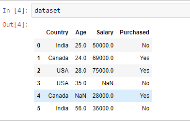

-   Looking at the dataset, we can say that we need to handle three things:

1.  Missing Data (NaN)
2.  Categorical Variables (Country, Purchased)
3.  Feature Scaling

# Step III: Features & Labels

-   We will be using the features(Country, Age & Salary) to predict the labels(Purchased).
-   So let’s separate our features and labels as sometimes we don’t want to apply the same transformations to both of them.
```python
dataset_features = dataset.drop('Purchased', axis = 1)  
dataset_labels = dataset.iloc[:, 3].values
```
# Step IV: Missing data

-   We can see that our dataset has two missing data. Now, there are three ways in which we can handle this problem:

## 1) Remove the rows that have the missing data
```python
`dataset_features = dataset_features.dropna(subset = ['Age', 'Salary'])`
```
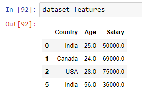

## 2) Get rid of the entire column
```python
dataset_features.drop(['Age', 'Salary'], axis = 1, inplace = True)
```
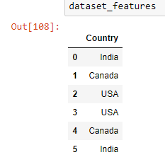

## 3) Replace the missing values with some value(mean, median, zero etc.)

-   We will use scikit-learn’s  _preprocessing_ library for this. From this library we will import the  _Imputer_ class.
```python
from sklearn.preprocessing import Imputer
```
-   Next, we will create an object  _imputer_ for the class.  [Click here](http://scikit-learn.org/stable/modules/generated/sklearn.preprocessing.Imputer.html)  for the parameters of  _Imputer_.
```python
imputer = Imputer(strategy = 'mean', axis = 0)
```
-   As the mean can only be computed on numerical attributes, we will create a copy of our dataset without the text attributes.
```python
dataset_num = dataset_features[['Age', 'Salary']]
```
-   Now it’s time to  [fit and transform](https://kite.com/python/docs/sklearn.preprocessing.Imputer.fit_transform)  our  _imputer_ object to  _dataset_num_.
```python
dataset_num = imputer.fit_transform(dataset_num)
```
-   Let’s take a look at  _dataset_num:_
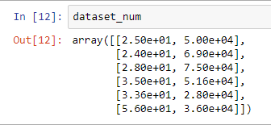

Great! The result  _dataset_num_ is a numpy array (we can convert into a dataframe) and we can see that the missing values have been replaced by the mean.

-   _imputer_ actually  stores the result of the mean in it  _statistics__ instance variable:
```python
imputer.statistics_  
>>>array([3.36e+01, 5.16e+04])dataset_features.mean().values 
 
>>>array([3.36e+01, 5.16e+04])
```
# Step V: Categorical Data

-   Our dataset has two categorical variables: Country & Purchased.
-   The  _Country_ contains three categories:
```python
dataset_features.Country.unique()
```
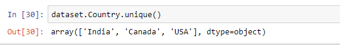

First, let’s fetch the categorical attributes from our dataset.
```python
dataset_cat = dataset_features[['Country']]
```
## Now the question is why categorical data needs to be handled?

-   It’s because the machine learning models are based on mathematical equations, so if we keep the text or categorical variables in the equation then it will cause some problem. Hence, we encode the categorical variables i.e. encode the text into numbers.(For example: USA = 2, India = 1, Canada = 0)
-   However, there’s one problem with this encoding — Since 2>1>0, the equation in the model would think that USA>India>Canada, which we know is not the case at all.
-   These are actually three categories and there is no relational order between them. Therefore, in order to prevent the machine learning model from this problem we use dummy variables.
-   Dummy variables are used to sort data into mutually exclusive categories. So instead of one column we will have three separate columns:
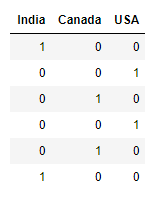

-   To create dummy variables we use another class called the  _OneHotEncoder_ from the scikit-learn  _preprocessing_ library.
```python
from sklearn.preprocessing import OneHotEncoder
```
-   Next, we create an object  _onehotencoder_ for the class OneHotEncoder. Then we fit and transform to our categorical attribute dataset_cat.
```python
onehotencoder = OneHotEncoder()dataset_cat_encoded = onehotencoder.fit_transform(dataset_cat).toarray()
```
-   The toarray() method is applied just to get a dense NumPy array, else the output would be a sparse matrix.
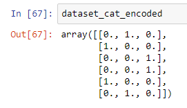

-   We do the same for our  _Purchased_ column. But since it is the dependent variable, the machine learning model will know that it is a category. Hence, there’s no need for one-hot encoding. We can simply encode them into integers using the  _OrdinalEncoder_ class.
```python
from sklearn.preprocessing import OrdinalEncoder

ordencoder = OrdinalEncoder()  
dataset_labels = ordencoder.fit_transform(dataset_labels.reshape(-1,1))
```

Awesome!

# Step VI: Feature Scaling

-   If we look at the age and the salary columns, we can see that they are not on the same scale. The age is ranging from 25 to 56, while the salary is in a range from 28k to 75k.
-   Many machine algorithms don’t perform well when the numerical attributes of the independent variables have very different scales. The two common ways of scaling the data are: min-max scaling(normalization) and standardization.

## Min-Max Scaling

-   Here all the values are subtracted by the minimum value and then divided by maximum minus the minimum. In this approach the data is usually scaled to a fixed range of 0 to 1.
-   To implement min-max scaling, we use the  _MinMaxScaler_ by scikit-learn. It also has a  _feature_range_ hyperparameter which can be used if we don’t want our scaling to be from 0 to 1.
```python
from sklearn.preprocessing import MinMaxScaler

scaler = MinMaxScaler()  
dataset_num_scaled = scaler.fit_transform(dataset_num)  
dataset_num_scaled
```
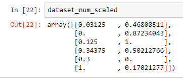
## Standardization

-   In standardization, all the values are subtracted by the mean and then it is divided by the variance. Hence, to have features with zero mean and a unit variance.
-   To implement standardization, we use the  _StandardScaler_ transformer from Scikit-learn.
```python
from sklearn.preprocessing import StandardScaler

std_scaler = StandardScaler()  
dataset_num_scaled = std_scaler.fit_transform(dataset_num)  
dataset_num_scaled
```
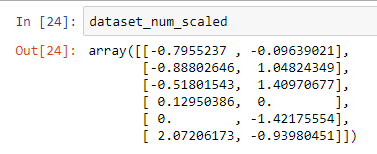

-   Note that unlike min-max scaling, standardization cannot guarantee balanced feature scales in the presence of outliers.
-   However, in the presence of an outlier the min-max scaling can compress all the inliers in a narrow range. Whereas standardization isn’t much affected by outliers.

As we can see that many data transformation steps are required and they all must be executed in the right order. We can actually create a Pipeline to have a single interface for all the transformations.
```python
from sklearn.pipeline import Pipeline

num_attribs = ['Age', 'Salary']  
cat_attribs = ['Country']

num_pipeline = Pipeline([  
    ('imputer', Imputer(strategy = 'mean')),  
    ('std_scaler', StandardScaler())  
])

cat_pipeline = Pipeline([  
    ('onehotencoder', OneHotEncoder())  
])

from sklearn.compose import ColumnTransformer

full_pipeline = ColumnTransformer(transformers = [  
    ('numeric', num_pipeline, num_attribs),  
    ('category', cat_pipeline, cat_attribs)  
])
```

-   And then we can simply run the whole pipeline and get the results:
```python
dataset_prepared = full_pipeline.fit_transform(dataset_features)
```
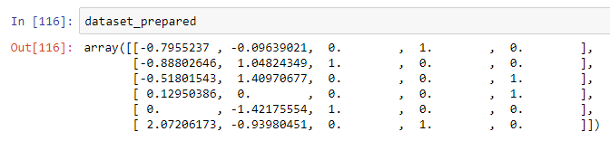

# Step VII: Training Set & Test Set

-   We build our machine learning model on a dataset i.e. the  _training set_ and then we test the performance of our model on the  _test set_. For this, we will use the scikit-learn’s  _train_test_split()_  function.
-   It has few parameters, but the one we will be using is the  _random_state_to set the random generator seed. Another parameter is the  _test_size_. Here will choose it as 20%(0.2).
```python
X_train, X_test, y_train, y_test = train_test_split(dataset_prepared, dataset_labels, test_size = 0.2, random_state = 42)
```
# Conclusion

Now we can say that our data is ready for training our model on! In real life however, datasets are HUGE but I believe this can be a good starting point to practice and learn and implement the same strategy on large datasets.