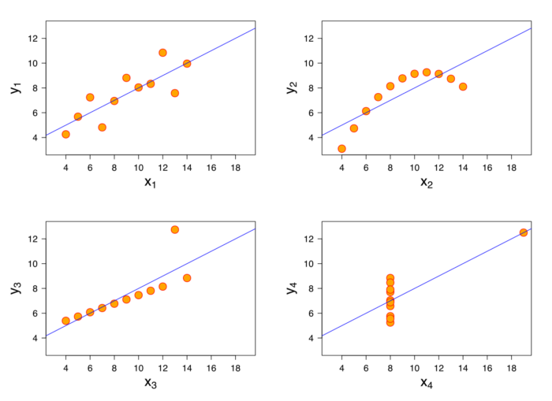

title: Anscombe's Quartet
date: 09/19/2018
author: Parth Shah
category: Blog

I always believed in “numerical calculations are exact, but graphs are rough”. Coming from a person who has just started learning Data Analytics, it was hard for me to understand the importance of Data Visualization along with summary statistics. But it all changed after attending this Data Visualization Meetup, which is when I was introduced to the *Anscombe’s Quartet*.

Anscombe’s Quartet was developed by statistician Francis Anscombe. It comprises four datasets, each containing eleven (x,y) pairs. The essential thing to note about these datasets is that they share the same descriptive statistics. But things change completely, and I must emphasize **COMPLETELY**, when they are graphed. Each graph tells a different story irrespective of their similar summary statistics.

The summary statistics show that the means and the variances were identical for x and y across the groups :

- Mean of x is 9 and mean of y is 7.50 for each dataset.
- Similarly, the variance of x is 11 and variance of y is 4.13 for each dataset
- The correlation coefficient (how strong a relationship is between two variables) between x and y is 0.816 for each dataset

When we plot these four datasets on an x/y coordinate plane, we can observe that they show the same regression lines as well but each dataset is telling a different story :

- Dataset I appears to have clean and well-fitting linear models.
- Dataset II is not distributed normally.
- In Dataset III the distribution is linear, but the calculated regression is thrown off by an outlier.
- Dataset IV shows that one outlier is enough to produce a high correlation coefficient.

This quartet emphasizes the importance of visualization in Data Analysis. Looking at the data reveals a lot of the structure and a clear picture of the dataset.

> A computer should make both calculations and graph. Both sorts of output should be studied; each will contribute to understanding.