title: Analyzing Teen Gambling and Prostate Cancer dataset using R
date: 09/13/2019
author: Parth Shah
category: Blog

This Fall I started my masters in data science at Rutgers University. In one of our Time Series and Regression class we were asked to analyze two datasets *teengamb* and *prostate* using R. This was my first time experimenting with R and it turned out to be a great learning experience.

## Problem 1: Analyzing dataset teengamb

### Loading data & libraries


```R
library(faraway)
library(tidyr)
library(purrr)
library(ggplot2)
library(ggpubr)
library(repr)
library(reshape2)
```

    
    Attaching package: 'tidyr'
    
    The following object is masked from 'package:reshape2':
    
        smiths
    
    The following object is masked from 'package:magrittr':
    
        extract
    
    


```R
data(teengamb)
df = teengamb
```


```R
head(df); tail(df)
```


<table>
<thead><tr><th scope=col>sex</th><th scope=col>status</th><th scope=col>income</th><th scope=col>verbal</th><th scope=col>gamble</th></tr></thead>
<tbody>
	<tr><td>1   </td><td>51  </td><td>2.00</td><td>8   </td><td> 0.0</td></tr>
	<tr><td>1   </td><td>28  </td><td>2.50</td><td>8   </td><td> 0.0</td></tr>
	<tr><td>1   </td><td>37  </td><td>2.00</td><td>6   </td><td> 0.0</td></tr>
	<tr><td>1   </td><td>28  </td><td>7.00</td><td>4   </td><td> 7.3</td></tr>
	<tr><td>1   </td><td>65  </td><td>2.00</td><td>8   </td><td>19.6</td></tr>
	<tr><td>1   </td><td>61  </td><td>3.47</td><td>6   </td><td> 0.1</td></tr>
</tbody>
</table>


<table>
<thead><tr><th></th><th scope=col>sex</th><th scope=col>status</th><th scope=col>income</th><th scope=col>verbal</th><th scope=col>gamble</th></tr></thead>
<tbody>
	<tr><th scope=row>42</th><td>0    </td><td>61   </td><td>15.00</td><td>9    </td><td>69.7 </td></tr>
	<tr><th scope=row>43</th><td>0    </td><td>75   </td><td> 3.00</td><td>8    </td><td>13.3 </td></tr>
	<tr><th scope=row>44</th><td>0    </td><td>66   </td><td> 3.25</td><td>9    </td><td> 0.6 </td></tr>
	<tr><th scope=row>45</th><td>0    </td><td>62   </td><td> 4.94</td><td>6    </td><td>38.0 </td></tr>
	<tr><th scope=row>46</th><td>0    </td><td>71   </td><td> 1.50</td><td>7    </td><td>14.4 </td></tr>
	<tr><th scope=row>47</th><td>0    </td><td>71   </td><td> 2.50</td><td>9    </td><td>19.2 </td></tr>
</tbody>
</table>


### Numerical analysis


```R
summary(df)
```


          sex             status          income           verbal     
     Min.   :0.0000   Min.   :18.00   Min.   : 0.600   Min.   : 1.00  
     1st Qu.:0.0000   1st Qu.:28.00   1st Qu.: 2.000   1st Qu.: 6.00  
     Median :0.0000   Median :43.00   Median : 3.250   Median : 7.00  
     Mean   :0.4043   Mean   :45.23   Mean   : 4.642   Mean   : 6.66  
     3rd Qu.:1.0000   3rd Qu.:61.50   3rd Qu.: 6.210   3rd Qu.: 8.00  
     Max.   :1.0000   Max.   :75.00   Max.   :15.000   Max.   :10.00  
         gamble     
     Min.   :  0.0  
     1st Qu.:  1.1  
     Median :  6.0  
     Mean   : 19.3  
     3rd Qu.: 19.4  
     Max.   :156.0  


- *sex* - It is considered as numeric here. So it needs to be converted to a categorical attribute.
- *status* - Seems like a normal distribution as the mean and median is concentrated in the center.
- *income* - Here the mean and median is closer to the minimum. So this might represent a right-skewed distribution.
- *verbal* - Mean, median is slightly closer to the maximum. So it could be slightly left-skewed.
- *gamble* - With mean(19.3) > median(6.0), this is heavily skewed to the right.


```R
df$sex = factor(df$sex, levels=c(0, 1), labels=c("male", "female")); summary(df$sex)
```


<dl class=dl-horizontal>
	<dt>male</dt>
		<dd>28</dd>
	<dt>female</dt>
		<dd>19</dd>
</dl>


```R
# Check for NAs
apply(df, 2, function(x) any(is.na(x)))
```


<dl class=dl-horizontal>
	<dt>sex</dt>
		<dd>FALSE</dd>
	<dt>status</dt>
		<dd>FALSE</dd>
	<dt>income</dt>
		<dd>FALSE</dd>
	<dt>verbal</dt>
		<dd>FALSE</dd>
	<dt>gamble</dt>
		<dd>FALSE</dd>
</dl>


None of the columns in the dataset have null values.

### Univariate Analysis

#### Status


```R
options(repr.plot.width=4, repr.plot.height=3)
ggplot(data = df) + geom_histogram(aes(x=status, y=..density..), bins=10) + 
                    geom_density(aes(x=status, y=..density..), color='black') +
                    ggtitle("Histogram of Status") +
                    theme(panel.grid.major = element_blank(), panel.grid.minor = element_blank(),
                        panel.background = element_blank(), axis.line = element_line(colour = "black"))
```


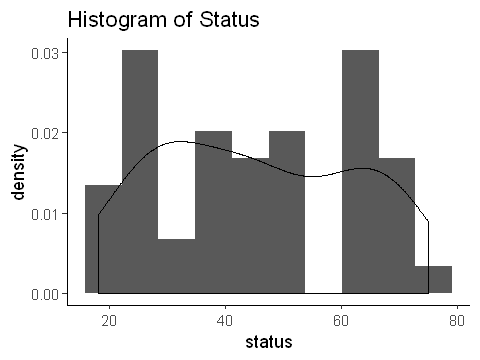


- As per the numerical analysis it was assumed that *status* follows a normal distribution. But the histogram above shows a slight bimodal distribution instead. This depicts that the social economic status is almost equally distributed across the entire dataset.

#### Income


```R
options(repr.plot.width=4, repr.plot.height=3)
ggplot(data = df) + geom_histogram(aes(x=income, y=..density..), bins=15) + 
                    geom_density(aes(x=income, y=..density..), color='black') +
                    ggtitle("Histogram of Income") +
                    theme(panel.grid.major = element_blank(), panel.grid.minor = element_blank(),
                        panel.background = element_blank(), axis.line = element_line(colour = "black"))
```


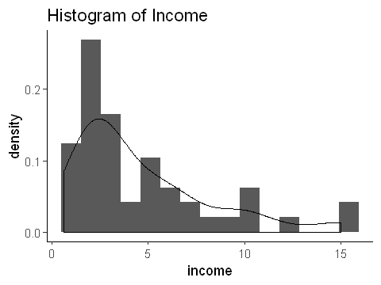


- As assumed the distribution is right-skewed which shows that most of the people in the dataset have a low-mid range income per week.

#### Verbal


```R
options(repr.plot.width=4, repr.plot.height=3)
ggplot(data = df) + geom_histogram(aes(x=verbal, y=..density..), bins=10) + 
                    geom_density(aes(x=verbal, y=..density..), color='black') +
                    ggtitle("Histogram of Verbal") +
                    theme(panel.grid.major = element_blank(), panel.grid.minor = element_blank(),
                        panel.background = element_blank(), axis.line = element_line(colour = "black"))
```


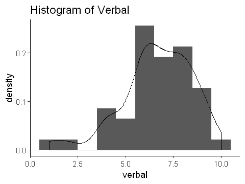


- The histogram of *verbal* is slightly left skewed showing that there are very few people with low verbal scores.

#### Gamble


```R
options(repr.plot.width=4, repr.plot.height=3)
ggplot(data = df) + geom_histogram(aes(x=gamble, y=..density..), bins=15) + 
                    geom_density(aes(x=gamble, y=..density..), color='black') +
                    ggtitle("Histogram of Gamble") +
                    theme(panel.grid.major = element_blank(), panel.grid.minor = element_blank(),
                        panel.background = element_blank(), axis.line = element_line(colour = "black"))
```


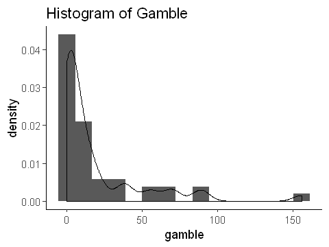


- As per the assumption in numerical analysis, the histogram of *gamble* is heavily skewed to the right. It represents that most of the people gamble less money while there are some who gamble over 80.00 pounds per year.

Also there seems to be a huge gap at the far end of the distribution.


```R
options(repr.plot.width=5, repr.plot.height=4)
plot(sort(df$gamble), ylab="Gamble", main = "Index plot Gamble")
```


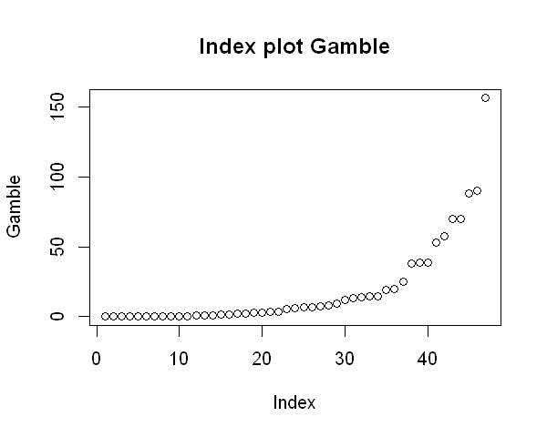


The linear model would be more accurate without this outlier, hence it is removed.


```R
df$gamble[df$gamble == max(df$gamble)] = NA
```


```R
# removing NAs
na_rows = apply(df, 1, function(x) any(is.na(x)))
df <- df[!na_rows,]
```

### Bivariate Analysis

#### Sex vs Gamble


```R
fill <- "#4271AE"
line <- "#1F3552"

options(repr.plot.width=4, repr.plot.height=3)
ggplot(data = df, aes(x=sex, y=gamble)) + geom_boxplot(fill=fill, colour=line, alpha=0.7) +
                    ggtitle("Sex vs Gamble") +
                    theme(axis.line = element_line(colour = "black"))
```


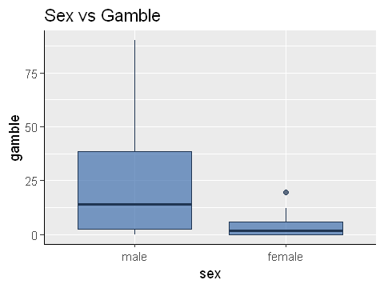


We can observe how the median for males is very separated from that of the females, which shows that males tend to spend more on gambling than females. Also the median for males is leaned towards **Q1** representing that most of the males spend between 0 to 15 pounds per year on gambling. While there are very few of them who spend above 25 pounds per year, hence skewed to the right.

#### Status vs Gamble


```R
options(repr.plot.width=4, repr.plot.height=3)
ggplot(data = df, aes(x=status, y=gamble)) + geom_point() + geom_smooth(method = 'lm') +
                    ggtitle("Status vs Gamble") +
                    theme(axis.line = element_line(colour = "black"))
```


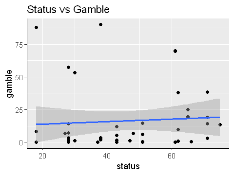


While an upward trend is observed depicting that people with higher status tend to gamble more, however, there are few people within low status that spend considerably more in gambling. In fact, most of the highest expenditure on gambling are from people within the low status.

#### Income vs Gamble


```R
options(repr.plot.width=4, repr.plot.height=3)
ggplot(data = df, aes(x=income, y=gamble)) + geom_point() + geom_smooth(method = 'lm') +
                    ggtitle("Income vs Gamble") +
                    theme(axis.line = element_line(colour = "black"))
```


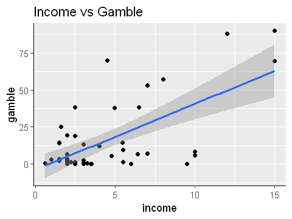


A nice upward trend is observed showing that people with higher income tend to spend more on gambling. Also we can observe below that even though males and females approximately have the same income, males tend to spend considerably more on gambling.


```R
options(repr.plot.width=5, repr.plot.height=4)
ggscatterhist(
  df, x = "income", y = "gamble",
  color = "sex", size = 3, alpha = 0.6,
  palette = c("#00AFBB", "#E7B800", "#FC4E07"),
  margin.plot = "boxplot",
  ggtheme = theme_bw()
  )
```


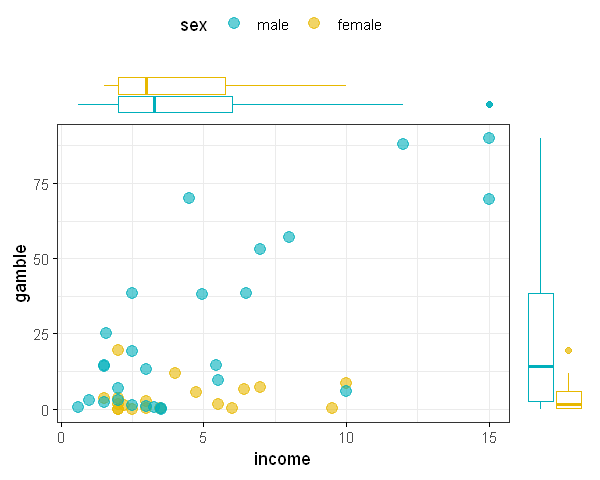


#### Verbal vs Gamble


```R
options(repr.plot.width=4, repr.plot.height=3)
ggplot(data = df, aes(x=factor(df$verbal), y=gamble, color=factor(df$verbal))) + geom_boxplot(alpha=0.7) +
                    ggtitle("Verbal Score vs Gamble") + xlab('Verbal Scores') +
                    theme(axis.line = element_line(colour = "black"), legend.position = "none")
```


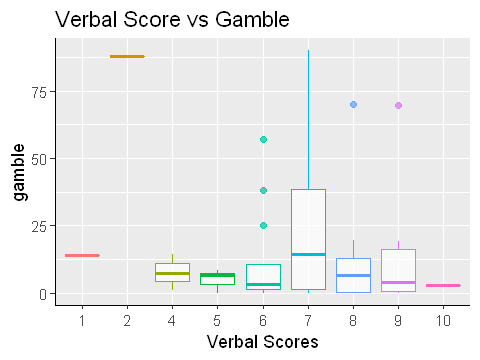


It can be observed that people with average verbal scores(5-8) tend to gamble more than the others. But this trend could also be because of the fact that most of the people in the dataset have above average verbal scores.

### Heatmap


```R
corr <- round(cor(teengamb), 2)
melt_df <- melt(corr)
```


```R
options(repr.plot.width=6, repr.plot.height=3)
ggplot(data=melt_df, aes(x=Var1, y=Var2, fill=value)) + 
            geom_tile(color='white') + 
            scale_fill_gradient2(low = "blue", high = "red", mid = "white", midpoint = 0, limit = c(-1,1), space = "Lab", 
               name="Pearson\nCorrelation") +
            theme_minimal() +
            theme(axis.text.x = element_text(angle = 45, vjust = 1, 
                size = 12, hjust = 1))+
                coord_fixed()
```


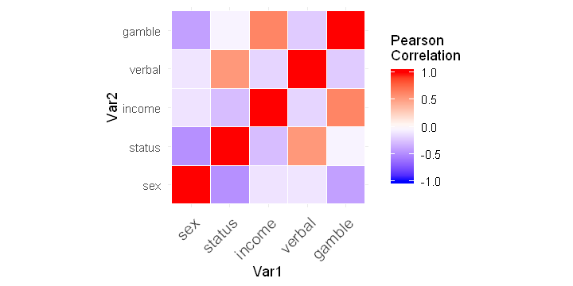


- As observed *income* is positively correlated to *gamble*, while other features doesn't seem to be well correlated to *gamble*.
- The other interesting feature is the positive correlation between *status* and *verbal*, showing that people with high status tend to have higher verbal scores.

### Fitting Linear Model


```R
options(repr.plot.width=4, repr.plot.height=4)
plot(gamble ~ income, df)
abline(0, 1)
g <- lm(gamble ~ income, df)
abline(coef(g), lty=5)
```


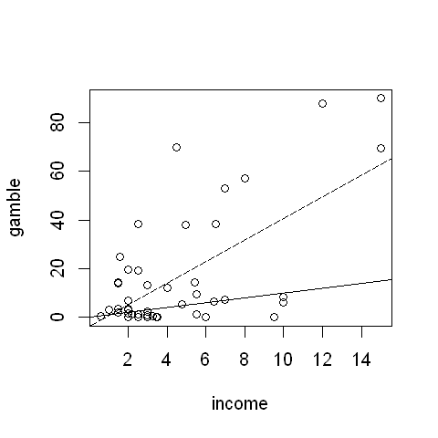


## Problem 2: Analyzing dataset prostate


```R
data(prostate)
```


```R
head(prostate); tail(prostate)
```


<table>
<thead><tr><th scope=col>lcavol</th><th scope=col>lweight</th><th scope=col>age</th><th scope=col>lbph</th><th scope=col>svi</th><th scope=col>lcp</th><th scope=col>gleason</th><th scope=col>pgg45</th><th scope=col>lpsa</th></tr></thead>
<tbody>
	<tr><td>-0.5798185</td><td>2.7695    </td><td>50        </td><td>-1.386294 </td><td>0         </td><td>-1.38629  </td><td>6         </td><td> 0        </td><td>-0.43078  </td></tr>
	<tr><td>-0.9942523</td><td>3.3196    </td><td>58        </td><td>-1.386294 </td><td>0         </td><td>-1.38629  </td><td>6         </td><td> 0        </td><td>-0.16252  </td></tr>
	<tr><td>-0.5108256</td><td>2.6912    </td><td>74        </td><td>-1.386294 </td><td>0         </td><td>-1.38629  </td><td>7         </td><td>20        </td><td>-0.16252  </td></tr>
	<tr><td>-1.2039728</td><td>3.2828    </td><td>58        </td><td>-1.386294 </td><td>0         </td><td>-1.38629  </td><td>6         </td><td> 0        </td><td>-0.16252  </td></tr>
	<tr><td> 0.7514161</td><td>3.4324    </td><td>62        </td><td>-1.386294 </td><td>0         </td><td>-1.38629  </td><td>6         </td><td> 0        </td><td> 0.37156  </td></tr>
	<tr><td>-1.0498221</td><td>3.2288    </td><td>50        </td><td>-1.386294 </td><td>0         </td><td>-1.38629  </td><td>6         </td><td> 0        </td><td> 0.76547  </td></tr>
</tbody>
</table>


<table>
<thead><tr><th></th><th scope=col>lcavol</th><th scope=col>lweight</th><th scope=col>age</th><th scope=col>lbph</th><th scope=col>svi</th><th scope=col>lcp</th><th scope=col>gleason</th><th scope=col>pgg45</th><th scope=col>lpsa</th></tr></thead>
<tbody>
	<tr><th scope=row>92</th><td>2.532903 </td><td>3.6776   </td><td>61       </td><td> 1.348073</td><td>1        </td><td>-1.38629 </td><td>7        </td><td>15       </td><td>4.12955  </td></tr>
	<tr><th scope=row>93</th><td>2.830268 </td><td>3.8764   </td><td>68       </td><td>-1.386294</td><td>1        </td><td> 1.32176 </td><td>7        </td><td>60       </td><td>4.38515  </td></tr>
	<tr><th scope=row>94</th><td>3.821004 </td><td>3.8969   </td><td>44       </td><td>-1.386294</td><td>1        </td><td> 2.16905 </td><td>7        </td><td>40       </td><td>4.68444  </td></tr>
	<tr><th scope=row>95</th><td>2.907447 </td><td>3.3962   </td><td>52       </td><td>-1.386294</td><td>1        </td><td> 2.46385 </td><td>7        </td><td>10       </td><td>5.14312  </td></tr>
	<tr><th scope=row>96</th><td>2.882564 </td><td>3.7739   </td><td>68       </td><td> 1.558145</td><td>1        </td><td> 1.55814 </td><td>7        </td><td>80       </td><td>5.47751  </td></tr>
	<tr><th scope=row>97</th><td>3.471967 </td><td>3.9750   </td><td>68       </td><td> 0.438255</td><td>1        </td><td> 2.90417 </td><td>7        </td><td>20       </td><td>5.58293  </td></tr>
</tbody>
</table>


### Numerical Analysis


```R
summary(prostate)
```


         lcavol           lweight           age             lbph         svi   
     Min.   :-1.3471   Min.   :2.375   Min.   :41.00   Min.   :-1.3863   0:76  
     1st Qu.: 0.5128   1st Qu.:3.376   1st Qu.:60.00   1st Qu.:-1.3863   1:21  
     Median : 1.4469   Median :3.623   Median :65.00   Median : 0.3001         
     Mean   : 1.3500   Mean   :3.653   Mean   :63.87   Mean   : 0.1004         
     3rd Qu.: 2.1270   3rd Qu.:3.878   3rd Qu.:68.00   3rd Qu.: 1.5581         
     Max.   : 3.8210   Max.   :6.108   Max.   :79.00   Max.   : 2.3263         
          lcp          gleason     pgg45             lpsa        
     Min.   :-1.3863   6:35    Min.   :  0.00   Min.   :-0.4308  
     1st Qu.:-1.3863   7:56    1st Qu.:  0.00   1st Qu.: 1.7317  
     Median :-0.7985   8: 1    Median : 15.00   Median : 2.5915  
     Mean   :-0.1794   9: 5    Mean   : 24.38   Mean   : 2.4784  
     3rd Qu.: 1.1786           3rd Qu.: 40.00   3rd Qu.: 3.0564  
     Max.   : 2.9042           Max.   :100.00   Max.   : 5.5829  


- *svi*, *gleason* seems to be categorical variables, so they are converted to categories using `factor`.
- *pgg45* seems to be heavily skewed to the right, while other features have their mean and median concentrated at the center.


```R
prostate$svi = factor(prostate$svi)
prostate$gleason = factor(prostate$gleason)
```

### Univariate Analysis


```R
# creating common ggplot function
prostate_histogram <- function(data, x, plot_title, bins)
    {
        options(repr.plot.width=4, repr.plot.height=3)
        p <- ggplot(data = data)
        p + geom_histogram(aes(x=x, y=..density..), bins=bins) + 
            geom_density(aes(x=x, y=..density..), color='black') +
            ggtitle(plot_title) +
            theme(panel.grid.major = element_blank(), panel.grid.minor = element_blank(),
                panel.background = element_blank(), axis.line = element_line(colour = "black"))       
}
```


```R
# plotting histograms of all numeric features
d <- prostate
options(repr.plot.width=6, repr.plot.height=4)
d %>%
  keep(is.numeric) %>%                     # Keep only numeric columns
  gather() %>%                             # Convert to key-value pairs
  ggplot(aes(value)) +                     # Plot the values
    facet_wrap(~ key, scales = "free") +
    geom_histogram(bins=12) 
```


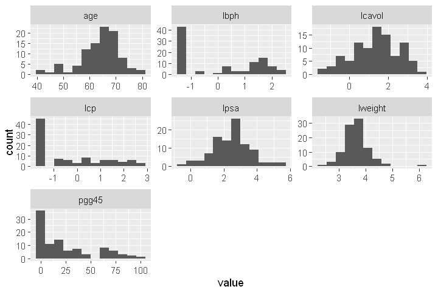


- *lbph* - Seems to have many features capped at $-1.386294$. Maybe it is the default value placed just in case it's missing.
- *lcp* - Just like *lbph*, it has many features capped at $-1.38629$ as well.
- *lweight* - Follows a normal distribution except for an outlier at $6.1076$.
- *pgg45* - As assumed it is heavily skewed to the right.


```R
options(repr.plot.width=5, repr.plot.height=4)
plot(sort(prostate$lweight), ylab="lweight", main = "Index plot lweight")
```


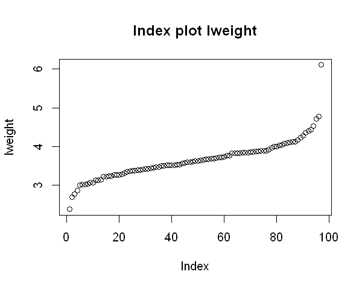


- The outlier may be removed if it correlates well with the response feature *lpsa*

### Bivariate Analysis

#### Log(Cancer Volume) vs Log(Prostate Specific Antigen)


```R
options(repr.plot.width=5, repr.plot.height=4)
ggplot(data = prostate, aes(x=lcavol, y=lpsa)) + geom_point() + geom_smooth(method = 'lm') +
                    ggtitle("Log(Cancer Volume) vs Log(Prostate Specific Antigen)") +
                    theme(axis.line = element_line(colour = "black"))
```


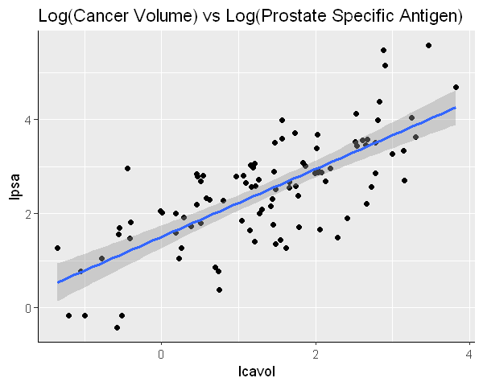


*lcavol* and *lpsa* are highly positively correlated. It shows that increase in the Log(Cancer Volume) leads to increase in the Log(Prostate Specific Antigen)


```R
options(repr.plot.width=5, repr.plot.height=4)
ggscatterhist(
  prostate, x = "lcavol", y = "lpsa",
  color = "svi", size = 3, alpha = 0.6,
  palette = c("#00AFBB", "#E7B800", "#FC4E07"),
  margin.plot = "boxplot",
  ggtheme = theme_bw()
  )
```


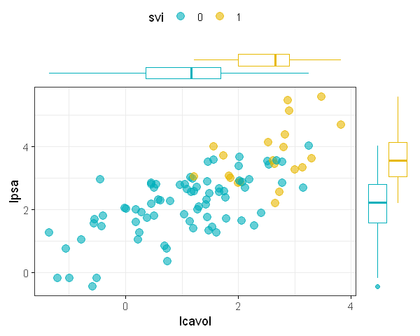


Patients with *seminal vesicle invasion* have higher *Log(Cancer Volume)*. Also those patients with *svi* and higher *Log(Cancer Volume)* also seem to have higher Log(Prostate Specific Antigen).

#### Log(Capsular Penetration) vs Log(Prostate Specific Antigen)


```R
options(repr.plot.width=5, repr.plot.height=4)
ggplot(data = prostate, aes(x=lcp, y=lpsa)) + geom_point() + geom_smooth(method = 'lm') +
                    ggtitle("Log(Capsular Penetration) vs Log(Prostate Specific Antigen)") +
                    theme(axis.line = element_line(colour = "black"))
```


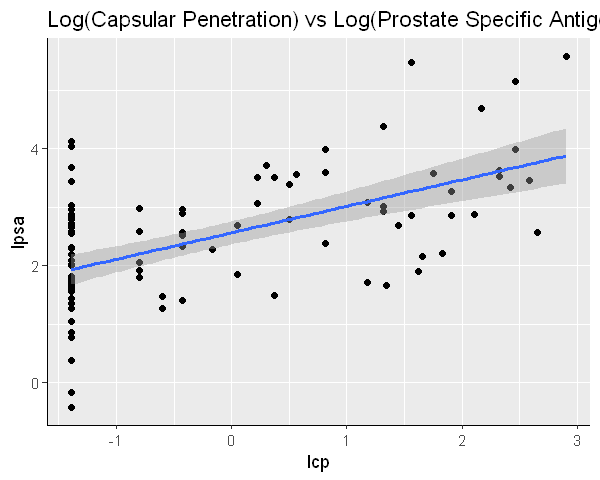


*Log(Capsular Penetration)* and *Log(Prostate Specific Antigen)* seems to be positively correlated as well. However as most of the features in *lcp* are capped at $-1.38629$, it needs more information.


```R
options(repr.plot.width=5, repr.plot.height=4)
ggscatterhist(
  prostate, x = "lcp", y = "lpsa",
  color = "svi", size = 3, alpha = 0.6,
  palette = c("#00AFBB", "#E7B800", "#FC4E07"),
  margin.plot = "boxplot",
  ggtheme = theme_bw()
  )
```


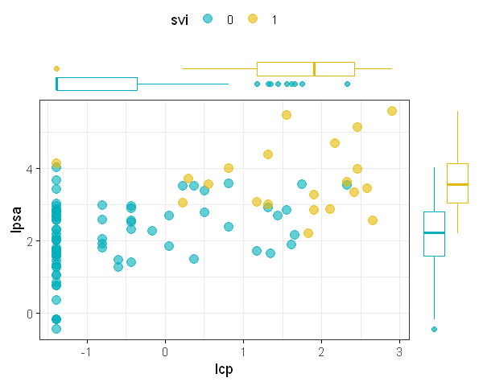


Patients with *svi* do seem to have higher *Log(Capsular Penetration)*. Just as *lcavol*, if patients have both *svi* and higher *lcp*, then they are likely to have higher *lpsa*.

#### svi vs lpsa


```R
options(repr.plot.width=4, repr.plot.height=3)
ggplot(data = prostate, aes(x=prostate$svi, y=lpsa, color=prostate$svi)) + geom_boxplot(alpha=0.7) +
                    ggtitle("SVI vs LPSA") + xlab('SVI') +
                    theme(axis.line = element_line(colour = "black"), legend.position = "none")
```


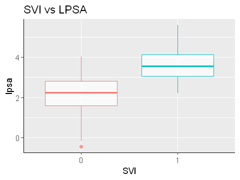


The median of patients with and without *svi* are well separated. Patients with *svi* are likely to have higher *lpsa*.

#### Percentage Gleason Scores vs LPSA


```R
options(repr.plot.width=5, repr.plot.height=4)
ggscatterhist(
  prostate, x = "pgg45", y = "lpsa",
  color = "gleason", size = 3, alpha = 0.6,
  palette = c("#00AFBB", "#E7B800", "#FC4E07", "#11BC11"),
  margin.plot = "boxplot",
  ggtheme = theme_bw()
  )
```


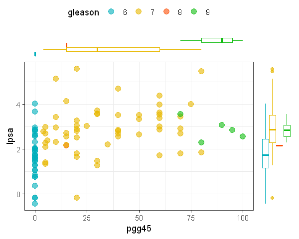


As *pgg45* is the percentage score of *gleason*, it increases as *gleason* increases. Also *gleason* score of 7,8,9 seems to have a slightly higher *lpsa* in comparison to that of 6.


```R

```

### Heatmap


```R
df2 <- data(prostate)
corr <- round(cor(prostate), 2)
melt_df <- melt(corr)
```


```R
options(repr.plot.width=6, repr.plot.height=3)
ggplot(data=melt_df, aes(x=Var1, y=Var2, fill=value)) + 
            geom_tile(color='white') + 
            scale_fill_gradient2(low = "blue", high = "red", mid = "white", midpoint = 0, limit = c(-1,1), space = "Lab", 
               name="Pearson\nCorrelation") +
            theme_minimal() +
            theme(axis.text.x = element_text(angle = 45, vjust = 1, 
                size = 12, hjust = 1))+
                coord_fixed()
```


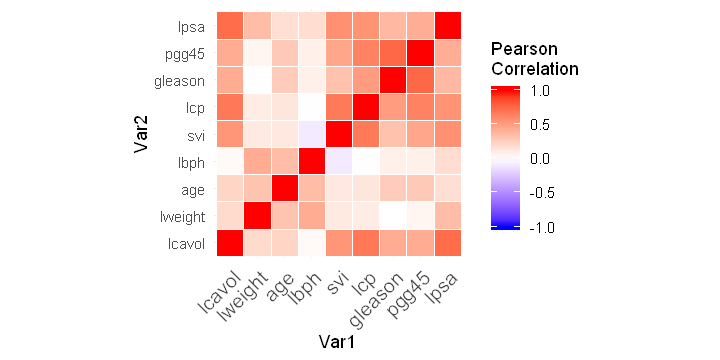


*lcavol, svi, lcp* are positively correlated to *lpsa*.

### Fitting linear model

#### lpsa ~ lcavol


```R
options(repr.plot.width=4, repr.plot.height=4)
plot(lpsa ~ lcavol, prostate)
abline(0, 1)
g <- lm(lpsa ~ lcavol, prostate)
abline(coef(g), lty=5)
```


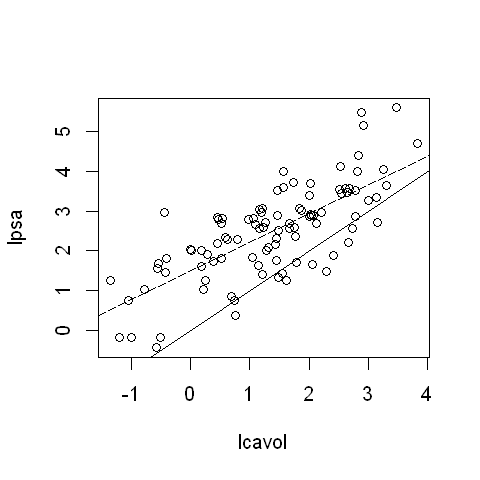


The dotted regression line seems to fit very well.

#### lcp ~ lspa


```R
options(repr.plot.width=4, repr.plot.height=4)
plot(lpsa ~ lcp, prostate)
abline(0, 1)
g <- lm(lpsa ~ lcp, prostate)
abline(coef(g), lty=5)
```


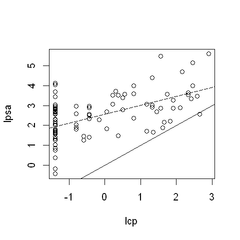


Even though the dotted line seems to be fitted very well, but inaccurate predictions could be made if the value of *lcp* is $-1.38629$
