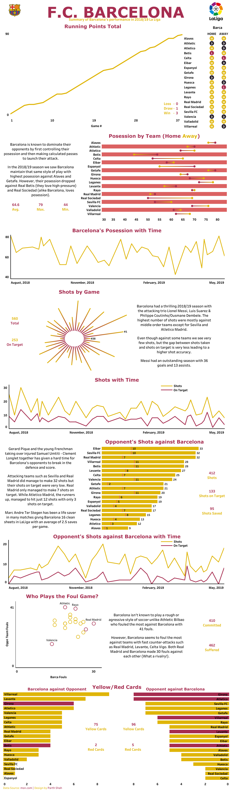

title: Scraping LaLiga Statistics 2018/19
date: 08/19/2019
author: Parth Shah
category: Blog


If there's anythin I do besides data science, then it's definitely watching soccer--especially LaLiga. You might hear me scream for a goal if you pass by my house on a weekend. Lately I realized that just watching LaLiga wasn't enough for me, I wanted to explore how each and every team is performing time-wise as well as against other teams. Questions such as "what team plays most aggressively?" "what team dominates the posession of the ball?" have been running through my mind.

After a lot of research I wasn't able to find the exact data I was looking for, so I decided to scrape it by myself. In this article with the help of Python, I will show how I scraped the match results along with game statistics for each team in LaLiga 2018/19 season. 

## Environment Setup
I have used Python 3.6 for this tutorial. The required libraries are as follows:

- numpy
- pandas
- bs4 (BeautifulSoup)
- urllib (Module for working with URLs)

## Web Scraping from [MSN](https://www.msn.com/en-us/sports/soccer/la-liga/scores/)


The website lists the scores for each month on a separate page and it follows this pattern: 

*https://www.msn.com/en-us/sports/soccer/la-liga/scores/*

*https://www.msn.com/en-us/sports/soccer/la-liga/scores/sp-d-20190428*

*https://www.msn.com/en-us/sports/soccer/la-liga/scores/sp-d-20190428-d-20190331*

*https://www.msn.com/en-us/sports/soccer/la-liga/scores/sp-d-20190428-d-20190331-d-20190303*

As we can notice the pattern here:(*I*)

http://............./sp-d-(*new-match-date*)-d-(*past-date*)-d-(*past-date*).

I recorded those dates in a list and created a function that gives me all the links.

```python
links = ['20190428', '20190331', '20190303', '20190203', '20190106', '20181209', '20181111', '20181014', '20180916', '20180819']

def fetch_website(links):
    urls = []
    url = 'https://www.msn.com/en-us/sports/soccer/la-liga/scores/'
    urls.append(url)
    url += 'sp'
    for i, l in  enumerate(links):
        url += '-d-' + links[i]
        urls.append(url)
    return urls
    
urls = fetch_website(links)
```

`['https://www.msn.com/en-us/sports/soccer/la-liga/scores/',
 'https://www.msn.com/en-us/sports/soccer/la-liga/scores/sp-d-20190428',
 'https://www.msn.com/en-us/sports/soccer/la-liga/scores/sp-d-20190428-d-20190331',
 'https://www.msn.com/en-us/sports/soccer/la-liga/scores/sp-d-20190428-d-20190331-d-20190303'...]`
 
 Once we have the links, all we have to do is create a script that runs through all the links and gives us the desired output. The page source of the web page looks like this:


Our scores are listed in the *sectionsgroup* container. Each team scores are in a *tbody* tag distributed by *even rowlink* and *odd rownlink* classes. Now we can use the power of BeautifulSoup to scrape the contents with just two functions:

- *find*: This function takes the name of the tag as string input and returns the first found match from the webpage. 
	- Here we will find the *div* container with class *sectionsgroup* that contains all the score results.
- *findAll*: to extract all the occurrences of a particular tag from the page.
	- Here we will *findAll* the *tbody* tags with classes *even rowlink* & *odd rowlink* and then loop through each of them to get the contents.

The following is the code to scrape just one webpage:
```python
url = 'https://www.msn.com/en-us/sports/soccer/la-liga/scores/'
html = urllib.request.urlopen(url).read()
raw = bs4.BeautifulSoup(html, 'lxml')
results = raw.find('div', {'class': 'sectionsgroup'}).findAll('tbody', {'class': ['even rowlink', 'odd rowlink']})
for r in results:
	home_team = r.find('td', {'class': 'teamname teaminline alignright size23'}).text.strip()
	away_team = r.find('td', {'class': 'teamname size23'}).text.strip()
	match_date = r.find('td', {'class': 'groupingcolumn paddingleft'}).find('div', {'class': 'matchdate'}).text.strip()
	scores = r.findAll('td', {'class': 'teamscore'})

	home_team_score = scores[0].text.strip()
	away_team_score = scores[1].text.strip()

	data_link = 'https://www.msn.com' + r.find('a').get('href')
```

This gives us the team names, match date, their scores and the *data_link*(link that takes us to a separate page for detailed statistics of each match) using just *find* and *findAll* tags. Now to run through all pages we just have to run this for each and every link and append the results to a list.

```python
def get_html(urls):
    teams = []
    for url in urls:
        html = urllib.request.urlopen(url).read()
        raw = bs4.BeautifulSoup(html, 'lxml')
        results = raw.find('div', {'class': 'sectionsgroup'}).findAll('tbody', {'class': ['even rowlink', 'odd rowlink']})
        for r in results:
            home_team = r.find('td', {'class': 'teamname teaminline alignright size23'}).text.strip()
            away_team = r.find('td', {'class': 'teamname size23'}).text.strip()
            match_date = r.find('td', {'class': 'groupingcolumn paddingleft'}).find('div', {'class': 'matchdate'}).text.strip()
            scores = r.findAll('td', {'class': 'teamscore'})
            
            home_team_score = scores[0].text.strip()
            away_team_score = scores[1].text.strip()

            data_link = 'https://www.msn.com' + r.find('a').get('href')
            
			teams.append([match_date.split(',')[0], match_date.split(',')[1][1:], home_team, away_team,
                          home_team_score, away_team_score, data_link])
		time.sleep(5)
	return teams
```

`
[['Sun',
  'May 19',
  'Eibar',
  'Barça',
  '2',
  '2',
  'https://www.msn.com/en-us/sports/soccer/la-liga/eibar-v-barcelona/game-center/sp-id-80402000001009693'],
 ['Sun',
  'May 19',
  'Real Madrid',
  'Betis',
  '0',
  '2',
  'https://www.msn.com/en-us/sports/soccer/la-liga/real-madrid-v-real-betis/game-center/sp-id-80402000001009694'],
  ...
 ]
`
 
Now I don't only want the scores, I want the detailed statistics for each and every match such as team's posession, offsides, fouls, etc. This can be obtained by following the same scraping process we did above, but now for each *data_link* that we obtain from each match.


**Note**: This image is from the 2019/20 season as msn have updated it to the current season.

The following is the page source for one of the matches:


The information of detailed stats is in the *div* container with id *matchupgamestatsmodule*. And all the individual statistics is present in the *div* container with class *statsitem*.

```python
html_link = urllib.request.urlopen(data_link)
raw_link = bs4.BeautifulSoup(html_link, 'lxml')
result_link = raw_link.find('div', {'id': 'main'}).find('div', {'id': 'matchupgamestatsmodule'}).findAll('div', {'class': 'statsitem'})
```

```html
[<div class="statsitem"> 
 <div class="statsvalue clearfix"> 
 <div class="firstteamstats">28</div> 
 <div class="label"> BALL POSSESSION % </div> 
 <div class="secondteamstats">72</div> </div> 
 ...
 <div class="firstteamstats">11</div> 
 <div class="label"> SHOTS </div> <div class="secondteamstats">11</div> 
 ...]
```
Here there is no way to separate out individual statistics as all the class labels have been named the same for each statistics. The only way to separate them out is the text of the *div* tag with class *label*. So instead of fetching each stats through html elements, I simply converted them into a list which is simply looping through each *statsitem* container and get the textual data.

```python
stats = []
for rl in result_link:
  stats.append(rl.text.split())
```
Now we have a nice list with individual statistics. The first and the last value in the list represent the stats of home team and away team respectively. 

[['28', 'BALL', 'POSSESSION', '%', '72'], 
['11', 'SHOTS', '11'], 
['5', 'SHOTS', 'ON', 'GOAL', '2'], 
['14', 'FOULS', '9'], 
['3', 'CORNERS', '8'], 
['2', 'SAVES', '4'], 
['2', 'OFFSIDES', '1'], 
['1', 'YELLOW', 'CARDS', '1'], 
['0', 'RED', 'CARDS', '0']]

The second element in each list would be an identifier for each type of stats. I created a separate function *get_stats(stats)* for that. The *stats* parameter in the function is the list we obtained above which can be passed through our main *get_html()* function.

```python
def get_stats(stats):
    stat_list = ['BALL', 'SHOTS', 'FOULS', 'CORNERS', 'SAVES', 'OFFSIDES', 'YELLOW', 'RED']
    len_stats = len(stats)
    home_shots_og = None
    away_shots_og = None
    home_saves = None
    away_saves = None
    home_offsides = None
    away_offsides = None
    home_poss = None
    away_poss = None
    home_fouls = None
    away_fouls = None
    home_shots = None
    away_shots = None
    home_corners = None
    away_corners = None
    home_yellow = None
    away_yellow = None
    home_red = None
    away_red = None
    for i in range(len_stats):
        if stats[i][1] in stat_list:
            if stats[i][1] == 'BALL':
                home_poss = stats[i][0]
                away_poss = stats[i][-1]
            if stats[i][1] == 'FOULS':
                home_fouls = stats[i][0]
                away_fouls = stats[i][-1]
            if stats[i][1] == 'CORNERS':
                home_corners = stats[i][0]
                away_corners = stats[i][-1]
            if stats[i][1] == 'SAVES':
                home_saves = stats[i][0]
                away_saves = stats[i][-1]
            if stats[i][1] == 'OFFSIDES':
                home_offsides = stats[i][0]
                away_offsides = stats[i][-1]
            if stats[i][1] == 'YELLOW':
                home_yellow = stats[i][0]
                away_yellow = stats[i][-1]
            if stats[i][1] == 'RED':
                home_red = stats[i][0]
                away_red = stats[i][-1]
            if stats[i][1] == 'SHOTS':
                if len(stats[i]) == 3:
                    home_shots = stats[i][0]
                    away_shots = stats[i][-1]
                else:
                    home_shots_og = stats[i][0]
                    away_shots_og = stats[i][-1]
    return(home_poss, away_poss, home_shots, away_shots, home_shots_og, away_shots_og, home_fouls, away_fouls, home_corners, 
           away_corners, home_saves, away_saves, home_offsides, away_offsides, home_yellow, away_yellow, home_red, away_red)

def get_html(urls):
    teams = []
    for url in urls:
        html = urllib.request.urlopen(url).read()
        raw = bs4.BeautifulSoup(html, 'lxml')
        ........
        data_link = 'https://www.msn.com' + r.find('a').get('href')
            
            try:
                html_link = urllib.request.urlopen(data_link)
            except urllib.error.HTTPError:
                # check this at the end. hard coded link
                html_link = urllib.request.urlopen('https://www.msn.com/en-us/sports/soccer/la-liga/eibar-v-barcelona/game-center/sp-id-80402000001009693')
            raw_link = bs4.BeautifulSoup(html_link, 'lxml')
            result_link = raw_link.find('div', {'id': 'main'}).find('div', {'id': 'matchupgamestatsmodule'}).findAll('div', {'class': 'statsitem'})
            
            stats = []
            for rl in result_link:
                stats.append(rl.text.split())
            res = get_stats(stats)
            teams.append([match_date.split(',')[0], match_date.split(',')[1][1:], home_team, away_team,
                          home_team_score, away_team_score, data_link, res[0], res[1], res[2], res[3],
                          res[4], res[5], res[6], res[7], res[8], res[9], res[10], res[11], res[12], res[13], res[14],
                          res[15], res[16], res[17]])

		time.sleep(5)
	return teams
```

This gives us all the match results with individual team statistics. We can also derive some statistics of our own from this. For example, I was curious to know if some teams are more likely to score in the first half or second half. So I created a separate function *get_score_count_perhalf(score_link)* to find number of goals scored by both home and away teams in each of the halves. 

```python
def get_score_count_perhalf(score_link):
    result_link = score_link.find('div', {'id': 'main'}).find('div', {'class': 'teamevent'})
    home_team_scores = []
    home_team_scores_firsthalf = 0
    home_team_scores_secondhalf = 0
    try:
        home_team_link = result_link.find('div', {'class': 'hometeamevent'}).findAll('span', {'class': 'scoremins'})
        for h in home_team_link:
            score = h.text.strip().split("'")[0]
            if int(score) <= 45:
                home_team_scores_firsthalf += 1
            if int(score) > 45:
                home_team_scores_secondhalf += 1
            home_team_scores.append(score)
    except AttributeError:
        # check this later.(Leganes vs Celta: Apr 27)
        home_team_scores.append(99)
        home_team_scores_firsthalf = 99
        home_team_scores_secondhalf = 99

    away_team_scores = []
    away_team_scores_firsthalf = 0
    away_team_scores_secondhalf = 0
        
    try:
        away_team_link = result_link.find('div', {'class': 'visitingteamevent'}).findAll('span', {'class': 'scoremins'})
        for a in away_team_link:
            score = a.text.strip().split("'")[0]
            if int(score) <= 45:
                away_team_scores_firsthalf += 1
            if int(score) > 45:
                away_team_scores_secondhalf += 1
            away_team_scores.append(score)
    except AttributeError:
        away_team_scores.append(99)
        away_team_scores_firsthalf = 99
        away_team_scores_secondhalf = 99
        
    return(home_team_scores_firsthalf, home_team_scores_secondhalf, away_team_scores_firsthalf, away_team_scores_secondhalf)
```

The *teams* list will now have all the information we needed. 
```python
all_matches = get_html(urls)
```

``
[['Sun',
  'May 19',
  'Eibar',
  'Barça',
  '2',
  '2',
  2,
  0,
  2,
  0,
  'https://www.msn.com/en-us/sports/soccer/la-liga/eibar-v-barcelona/game-center/sp-id-80402000001009693',
  '39',
  '61',
  '18',
  '8',
  '8',
  '3',
  '17',
  '5',
  '5',
  '2',
  '1',
  '6',
  None,
  None,
  '4',
  '2',
  '0',
  '0'],
 ['Sun',
  'May 19',
  'Real Madrid',
  'Betis',
  '0',
  '2',
  0,
  0,
  0,
  2,
  'https://www.msn.com/en-us/sports/soccer/la-liga/real-madrid-v-real-betis/game-center/sp-id-80402000001009694',
  '47',
  '53',
  '9',
  '9',
  '2',
  '7',
  '18',
  '10',
  '1',
  '5',
  '5',
  '2',
  '1',
  '4',
  '4',
  '1',
  '0',
  '0'],...]
  ``

Now we can very simply convert into a dataframe and start analyzing!

```python
cols = ['match_day', 'match_date', 'home_team', 'away_team', 'home_team_score', 'away_team_score', 'HT_num_goals_firsthalf', 
            'HT_num_goals_secondhalf', 'AT_num_goals_firsthalf', 'AT_num_goals_secondhalf', 'match_link', 'home_posession', 
            'away_posession', 'home_shots', 'away_shots', 'home_shots_ontarget', 'away_shots_ontarget', 'home_fouls', 
            'away_fouls', 'home_corners', 'away_corners', 'home_saves', 'away_saves', 'home_offsides', 'away_offsides', 
            'home_yellow', 'away_yellow', 'home_red', 'away_red']
df = pd.DataFrame(all_matches, columns=cols)
```


Now we can play around with this data and find insights. I am a huge fan of Barcelona so I decided to explore their different statistics and how they perform against other teams. 

Here is one of the plot that I made in Tableau (dashboard building in progress) that explores the number of fouls committed by Barcelona against other teams and vice-versa.

<iframe src="https://public.tableau.com/views/BarcaStatsLaLiga201819/Barca?:showVizHome=no:embed=true"></iframe>


Thank you for reading! Don't hesitate to reach out to me if you have any suggestion or an improvement.